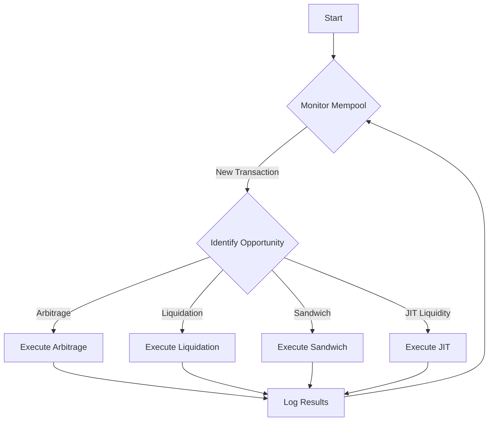
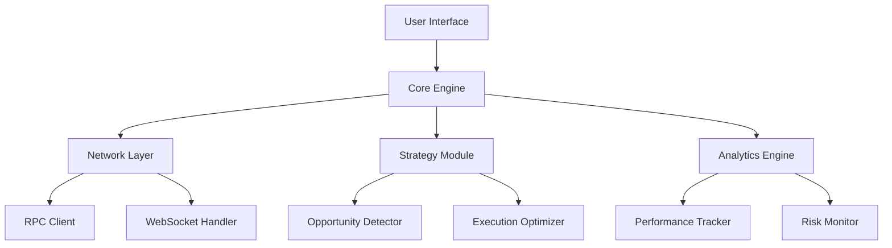
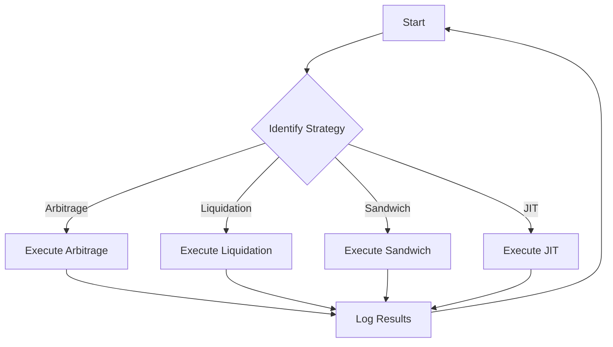

# Solana MEV Bot

Welcome to the **Solana MEV Bot**! This Rust-based bot is designed for executing Maximal Extractable Value (MEV) strategies on the Solana blockchain. This comprehensive guide will help you understand, set up, and optimize your MEV operations.

## Table of Contents
- [Introduction to MEV](#introduction-to-mev)
- [Features](#features)
- [Architecture](#architecture)
- [Bot Logic Overview](#bot-logic-overview)
- [Installation](#installation)
- [Configuration](#configuration)
- [Usage](#usage)
- [Strategies](#strategies)
- [Performance Optimization](#performance-optimization)
- [Risk Management](#risk-management)
- [Troubleshooting](#troubleshooting)
- [Contributing](#contributing)
- [Security](#security)
- [FAQ](#faq)
- [Diagrams](#diagrams)

## Introduction to MEV
### What is MEV?
Maximal Extractable Value (MEV) represents the maximum value that can be extracted from block production in excess of the standard block rewards and gas fees. On Solana, MEV opportunities arise from:

- Transaction ordering
- Price discrepancies across DEXs
- Liquidation opportunities
- Sandwich trading
- Just-In-Time (JIT) Liquidity

### MEV on Solana
Solana's unique characteristics make it particularly suitable for MEV extraction:

- High throughput (65,000+ TPS)
- Sub-second finality
- Low transaction costs
- Rich DeFi ecosystem

## Features

### Core Features
- **High-Speed Transaction Processing**
  - Custom transaction optimization
  - Parallel transaction execution
  - Memory-pooling for reduced latency
  - Advanced mempool monitoring

- **Advanced Strategy Implementation**
  - Multiple strategy support
  - Strategy composition
  - Dynamic strategy switching
  - Risk management integration

- **Real-Time Analytics**
  - Performance metrics
  - Strategy effectiveness tracking
  - Risk exposure monitoring
  - Profit/loss analysis

### Technical Capabilities
- **Network Optimization**
  - Direct RPC node connections
  - Custom RPC endpoint management
  - Network latency optimization
  - Redundant connection handling

- **Smart Contract Integration**
  - Program account monitoring
  - Custom instruction composition
  - Account lookup optimization
  - Cross-program invocation handling

## Architecture

### System Components
1. **Core Engine**
   - Transaction manager
   - Strategy executor
   - State manager
   - Event system

2. **Network Layer**
   - RPC client manager
   - WebSocket handlers
   - Connection pool
   - Retry mechanism

3. **Strategy Module**
   - Strategy framework
   - Opportunity detector
   - Risk calculator
   - Execution optimizer

4. **Analytics Engine**
   - Performance tracker
   - Risk monitor
   - Profit calculator
   - Strategy analyzer

## Bot Logic Overview

The bot operates based on a series of logical steps to identify and execute profitable MEV opportunities. The following flowchart illustrates the bot's logic:



### Logic Flow
1. **Monitor Mempool**: Continuously observe the mempool for new transactions.
2. **Identify Opportunity**: Analyze incoming transactions to identify potential MEV opportunities.
3. **Execute Strategy**: Depending on the identified opportunity, execute the corresponding strategy (arbitrage, liquidation, sandwich trading, or JIT liquidity).
4. **Log Results**: Record the outcomes of executed strategies for performance analysis and optimization.

## Installation

### Prerequisites
- Rust 1.65 or higher
- Solana CLI tools
- Linux/Unix-based OS (recommended)
- Minimum 16GB RAM
- SSD storage

### Step-by-Step Setup

1. **Clone the Repository**:
   ```bash
   git clone https://github.com/Kelvin-1013/solana-arbitrage-bot-2.git
   cd solana-mev-bot-optimized
   ```

2. **Install Dependencies**:
   ```bash
   # Install Rust
   curl --proto '=https' --tlsv1.2 -sSf https://sh.rustup.rs | sh

   # Install Solana
   sh -c "$(curl -sSfL https://release.solana.com/v1.14.17/install)"

   # Build the project
   cargo build --release
   ```

3. **Configure Environment**:
   ```bash
   cp .env.example .env
   # Edit .env with your settings
   ```

## Configuration

### Basic Configuration
```toml
[network]
rpc_endpoints = ["https://api.mainnet-beta.solana.com"]
ws_endpoints = ["wss://api.mainnet-beta.solana.com"]
backup_endpoints = ["https://solana-api.projectserum.com"]

[wallet]
keypair_path = "~/.config/solana/id.json"
minimum_balance = 1.0  # SOL

[strategies]
enabled = ["arbitrage", "liquidation"]
max_concurrent = 3
```

### Advanced Settings
```toml
[performance]
max_threads = 16
memory_pool_size = 1024
transaction_timeout = 15000  # ms

[risk]
max_position_size = 100000  # USD
max_slippage = 0.5  # %
stop_loss = 2.0  # %
```

## Usage

### Basic Operation
1. **Start the Bot**:
   ```bash
   cargo run --release -- --config config.toml
   ```

2. **Monitor Performance**:
   ```bash
   cargo run --release -- --monitor
   ```

3. **Strategy Management**:
   ```bash
   cargo run --release -- --strategy-status
   cargo run --release -- --enable-strategy arbitrage
   cargo run --release -- --disable-strategy liquidation
   ```

### Advanced Usage
- Custom strategy implementation
- Performance tuning
- Risk parameter adjustment
- Network optimization

## Strategies

### Implemented Strategies

1. **Arbitrage**
   - DEX price discrepancy monitoring
   - Path optimization
   - Execution timing
   - Position sizing

2. **Liquidation**
   - Health factor monitoring
   - Gas optimization
   - Flashloan integration
   - Collateral valuation

3. **Sandwich Trading**
   - Mempool monitoring
   - Transaction ordering
   - Gas price optimization
   - Position calculation

4. **JIT Liquidity**
   - Pool depth analysis
   - Timing optimization
   - Risk assessment
   - Position management

### Strategy Development
- Framework overview
- Implementation guidelines
- Testing procedures
- Optimization techniques

## Performance Optimization

### Network Optimization
- RPC endpoint selection
- WebSocket connection management
- Transaction propagation
- Block subscription

### Execution Optimization
- Memory management
- Thread allocation
- Transaction batching
- Instruction optimization

### Strategy Optimization
- Parameter tuning
- Backtesting framework
- Performance metrics
- Strategy evaluation

## Risk Management

### Risk Parameters
- Position limits
- Slippage tolerance
- Stop-loss mechanisms
- Exposure limits

### Monitoring
- Real-time risk assessment
- Position tracking
- Market condition monitoring
- Alert system

### Safety Measures
- Emergency shutdown
- Fund protection
- Error handling
- Recovery procedures

## Troubleshooting

### Common Issues
- Connection problems
- Transaction failures
- Strategy errors
- Performance issues

### Debugging Tools
- Logging system
- Error tracking
- Performance profiling
- Network diagnostics

## Contributing

### Development Guidelines
- Code style
- Testing requirements
- Documentation standards
- Review process

### Testing
- Unit tests
- Integration tests
- Strategy tests
- Performance tests

## Security

### Best Practices
- Key management
- Access control
- Network security
- Update procedures

### Audit Results
- Security assessment
- Vulnerability fixes
- Recommended practices
- Ongoing monitoring

## FAQ

### General Questions
1. What is the minimum capital required?
2. How are profits calculated?
3. What are the risks involved?
4. How to optimize performance?

### Technical Questions
1. How to implement custom strategies?
2. What are the hardware requirements?
3. How to handle network issues?
4. How to upgrade safely?

## Diagrams

### Bot Architecture Diagram


### Strategy Flow Diagram


## License
MIT License - See LICENSE file for details

## Disclaimer
This software is for educational purposes only. Use at your own risk. The developers are not responsible for any financial losses incurred through the use of this software.

## Support
For support, please open an issue on GitHub or join our Discord community.

---

Last updated: [Current Date]
Version: 1.0.0

